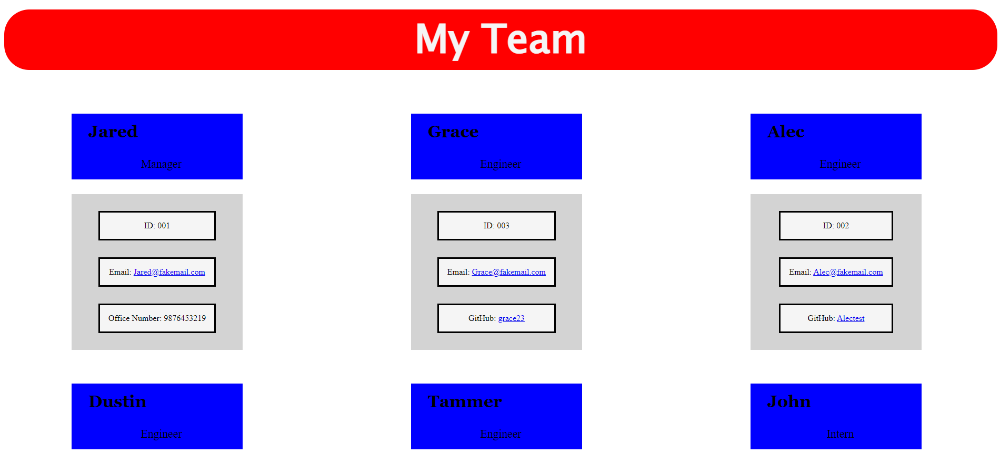

  # Team-Profile-Generator
  

  
  ## Table-of-Contents
  * [Description](#description)
  * [Installation](#installation)
  * [Usage](#usage)
  * [Contributing](#contributing)
  * [Tests](#tests)
  * [Questions](#questions)

[Open](https://choosealicense.com/licenses/Open)

 
  ## [Description](#table-of-contents)
  An application that will take user input from the command line and generate an HTML file organizing employee profiles by there applied roles. Demonstrating the use of OOP and TDD using Jest

  

  ## [Installation](#table-of-contents)
  User should clone rpository and download Node. Also featured is the inquirer module.

  ## [Usage](#table-of-contents)
  Use your command line terminal and start the project with "node index.js"

  Here is a link to a video tutorial on using the application:
  [Tutorial](https://watch.screencastify.com/v/ffBmBVjOr1CzYjEVOPfc)

  ## [License](#table-of-contents)
  This application has the following license:
  [Open](https://choosealicense.com/licenses/Open)
    
  ## [Contributing](#table-of-contents)
    
   
  ## [Tests](#table-of-contents)
  The command "npm test" will run the test through Jest
  ## [Questions](#table-of-contents)
  Contact me with any questions at the following:

  [GitHub](https://github.com/BurnsD)

  [Email: DustinBurnsDev@Gmail.com](mailto:DustinBurnsDev@Gmail.com)
  
